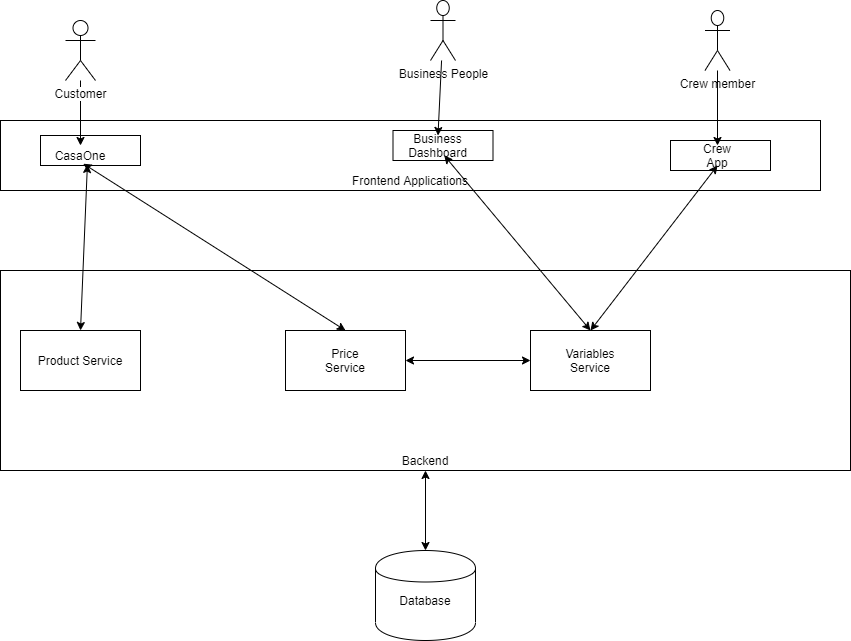

# Product variables growth

## Task

```
Every product (furniture item) has an associated product ID. There are some variables that are fixed to the product and we know them when we buy the product. Examples for fixed variables: color, finish, purchase price, etc


There are few variables we need to now capture which are derived

- Ops related variables

Examples: Time to assemble the product, cost of assembly, etc

Note that these derived variables can change in value over a period of time as well. For example, the delivery crew can handle the installation better since they become experts and the 'Time to assemble the product' variable changes.

I want to know your thoughts on these

So far, we have handled the fixed variables well. How do you think we should proceed with the 'derived' variables? How do we bake it into our system? If the business teams need to make a decision based on the derived variables, how will you help the teams get it? How will you ensure that the 'derived values' are updated with the latest value?
```

## Solution

According to me, there are various approaches to handle these variables. Let's go ahead and discuss these approaches:

### 1. Fixed amount for a product category

The simplest way to handle these variables is to store the values w.r.t the product categories. This method is often used by local furniture vendors.

For example:

> Cost of installation of a King-size bed is 1000 INR.

Advantages of this approach:

1. This approach is simple w.r.t. implementation.
2. No/small calculation required to derive the values.

Disadvantages:

1. Difficult to categorize and maintain prices for the category. This approach might be good for small furniture vendors, but for a company like CasaOne, which has a huge variety of products, categorizing w.r.t. the variable costs would be a challenging task.
2. Scalability: There might be a huge number of variables that might affect the cost in the future. This approach might not work if the number of variables increases.
3. The same cost might not hold good for all the products in the same category. Ex: A new product, King-sized bed, is offered to the customers which have a cost of assembly way more than normal king-sized beds. It would be difficult to derive the cost of this approach.

### 2. Running Average/Mean

In this approach, the variables are calculated on the fly based on the history of the product(ex: last 10 deliveries).

> Note: Calculating average based on the past deliveries would not make much sense if it was done long back. Ex: If a product was delivered in 2015, and we consider that cost for our calculation in 2020, then the value wouldn't be that accurate. So, it is important to filter out data for calculation on a periodic basis.

#### How do we bake it into our system?

The installation person can be provided with a UI, where after each delivery he would have to input the actual cost that was incurred. This data can be used to derives the cost of the product.

Moreover, these data can be used by the company to analyze cost trends so that the CasaOne can take some steps to reduce these variables.

#### If the business teams need to make a decision based on the derived variables, how will you help the teams get it?

We would provide an analytical dashborad for the business team to get advantage of this data so that they can take important bussiness decision based on the data.

Advantages of this approach:

1. It would give more realistic results.
2. Scalable. This approach is capable of handling a number large number of variables.
3. This approach can help CasaOne analyze and improve the variable costs so that customers get more benefits.

Disadvantages:

1. Implementation is more complex than the first approach.
2. Since the calculation is happening on the fly, it might take some more time to calculate.
3. The calculation of variables for a new product might be tricky. One solution is that we can fall back to the first approach in case of a new product.

### 3. Machine Learning Algorithm

In this approach, we use a Machine Learning based algorithm to analyze the past data and predict the values.

#### How will you ensure that the 'derived values' are updated with the latest value?

Whenever the installation person enters a new value of installation, our engine to calculate the latest value is triggered. As soon as the calculation is done, the new values are updated w.r.t. the product. These asyncronous tasks can be ensured by a message broker.

Ex: A crew member installs a King-sized bed for a customer. He would update the price and time it took for him to install. This would trigger our ML algorithm to recalculate the prices and then update the prices w.r.t the latest delivery.

Moreover, based on the implementation of the ML algorithm, we might also derive many factors that were not visible from the human eye. Ex: Based on the result, the installation of `Wakefit Andromeda Sheesham Bed` takes more time during December. The reason when investigated was that the wood that it uses shrinks in the winters. So we can take steps to improve the quality of the products so that our installation time reduces.

Advantages of this approach:

1. More realistic results can be derived.
2. It can help us gather more insights into the variables so that we can take steps to improve those.

Disadvantages:

1. Implementation is even more complex.
2. Require lots of data to derive the values - `cold-start problem`.

## Conclusion

Since all the approaches have advantages and disadvantages, we can proceed with a phased approach. 
We can start with [running average](#2-running-averagemean) and as we have a good ML algorithm with a good accuracy-rate, we can slowly shift towards it.

The image below shows an overview of the architecture. In future, `Variables Service` can be extended to support ML use-cases.

