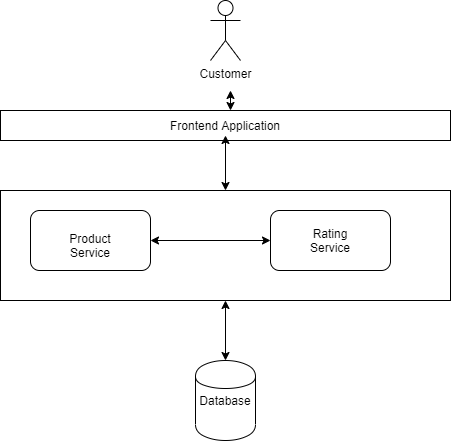

# Design rating platform

## Task

```

Let's say a customer rents 5 different products (furniture) from CasaOne. We need to capture the ratings from the customer for all of these products after customer starts using the furniture. We also need to display the ratings on the website next to the product. This product rating feature is similar to product ratings on Flipkart and Amazon


Here is what you can submit as part of the assignment

- How will you design the flow. Architecture diagram with an explanation will help. What will the user do and what will the system do

- Code for API to fetch ratings for the product. This should also return average product rating and count for individual ratings


NOTE: Please make assumptions where required and highlight them when sharing your response.

```

## Solution

### Assumptions

1. In the solution, I have stored the data in-memory itself in an array.
2. User can provide rating of `1`, `2`, `3`, `4` or `5`. No decimal rating is supported in current implementation.

The rating service shows ratings of the product to the customers and submits ratings given by customers for a product. This can be better explained by the below image:


Customer, when views the product, can also see the rating of the product given by other customers. We use `rating service` to calculate the rating of the product.

### Instructions to run the application

To run the application, use the following command:

```sh
npm start
```

**Note:** Currently, this application is using port `3000`, so make sure that port 3000 is available. Or you can change the port in [this file](src/util/index.ts).

To run the app for development environment, use the following command:

```sh
npm run dev
```

To run the tests, use the following command:

```sh
npm test
```

### Usage of application

#### Get /rating

This route gets all the ratings in the system.

```curl
curl -X GET http://localhost:3000/rating
```

Response:

```json
[
  {
    "id": "1",
    "productId": "1",
    "givenBy": "Tom",
    "rating": 5
  },
  {
    "id": "2",
    "productId": "1",
    "givenBy": "Harry",
    "rating": 4
  }
]
```

#### Get /rating/:ratingId

This route gets the ratings whose id is passed as parameter

```curl
curl -X GET http://localhost:3000/rating/1
```

Response:

```json
{
  "id": "1",
  "productId": "1",
  "givenBy": "Tom",
  "rating": 5
}
```

#### POST /rating

This route create a new rating in the system.

```curl
curl -X POST -H "Content-type: application/json" -d '{
  "productId": "1",
  "givenBy": "Tom",
  "rating": 1
}' 'http://localhost:3000/rating'
```

#### Get /rating/product/:productId

This route can be used to get rating aggregations of a product.

```curl
curl -X GET http://localhost:3000/rating/product/1
```

Response -

```json
{
  "productId": "1",
  "rating": {
    "total": 10,
    "average": 3.7,
    "count": {
      "1": 1,
      "2": 1,
      "3": 1,
      "4": 4,
      "5": 3
    }
  }
}
```

#### POST /rating/create/data

This route create dummy data in the system.

## Areas of improvement

1. Currently I am storing data in-memory. This can be extended to use a database.
2. There is no pagination or search feature in the service.
3. Currently only implemented POST and GET for `/rating`. We can also implement other HTTP methods.
4. More tests could have been written to consider more cases.
5. Integration tests could also have been written.
